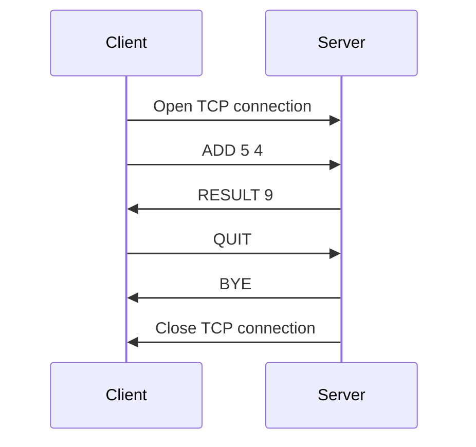
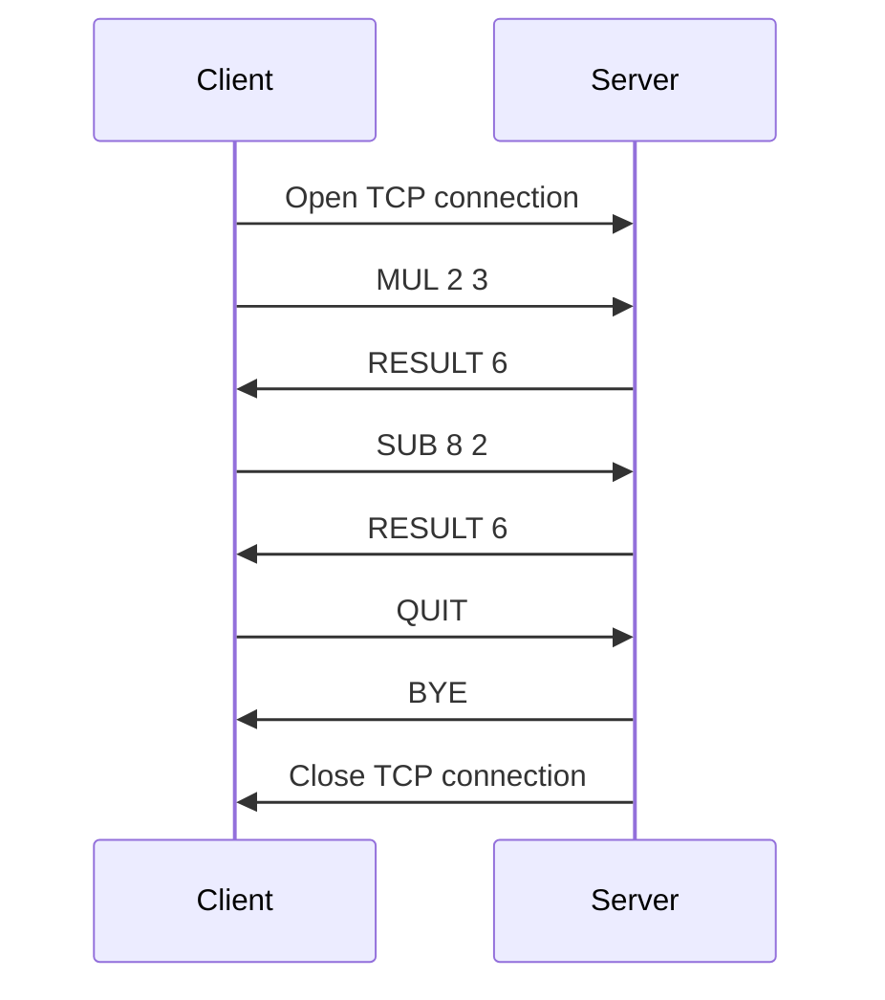
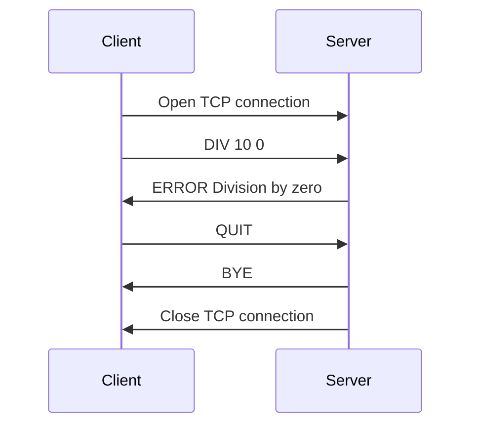

# 1. Overview

- **Objective:** This protocol enables a client to request simple arithmetic calculations (addition and multiplication) from a server. The server receives the operation and operands, computes the result, and sends it back to the client.

- **General Behavior:** The client initiates the connection, specifies operations and operands through the standard input (stdin), and the server responds with computed values.

# 2. Transport Layer Protocol

- **Protocol Choice:** 
    - TCP is recommended for reliable communication, ensuring message delivery without loss.
- **IP Address and Port:**
    - The server listens on a specified IP address and TCP port `5656`
    - The client establishes a connection to the server's IP and port.
- **Connection Creation and Termination:**
    - The **client initiates** the connection by sending a request to the server’s IP and port.
    - The **server accepts** the connection and keeps it open.
    - The **client** can close the connection by sending a special command `QUIT`

# 3. Message

- `ADD <Number1> <Number2>`
    - The client request the result of an addition. The numbers can be integers or floats.
- `MUL <Number1> <Number2>`
    - The client request the result of an multiplication. The numbers can be integers or floats.
- `SUB <Number1> <Number2>`
    - The client request the result of an substraction. The numbers can be integers or floats.
- `DIV <Number1> <Number2>`
    - The client request the result of an division. The numbers can be integers or floats.
- `RESULT <Result_Number>`
    - The server sends the result
- `ERROR <Error>`
    - Error response after an incorrect operation message. Do not close connection.
- `QUIT`
    - Can also be sent by the client to close the connection.
- `HELP`
  - Show user manual.
- `BYE`
    - The server says bye.

# 4. Example dialogs

## Addition

## Multiplication and substraction

## Error division by 0

